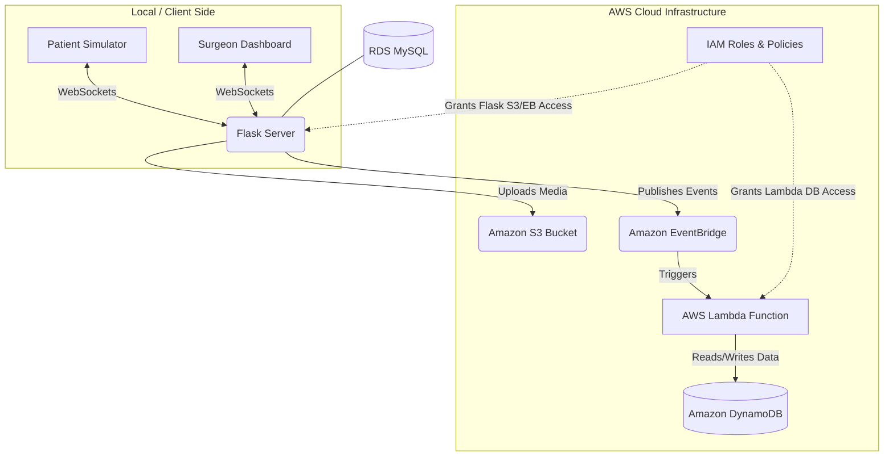

# Remote Surgical Supervision System

A real-time remote surgical supervision system built with Flask, WebSockets (Flask-SocketIO), SQLite/MySQL, and comprehensive AWS Cloud-Native Services (S3, EventBridge, Lambda, DynamoDB, IAM).

## Features
- **Role-based Access Control:** Secure authentication for 'patient' and 'surgeon' roles using Flask-Login.
- **Patient Simulator:** Emulates real-time vital signs streaming via WebSockets. Periodically injects abnormalities for training and testing.
- **Surgeon Dashboard:** Receives low-latency vital updates. Emits visual/audio alarms on abnormalities. Allows the surgeon to provide text/audio suggestions, triggering a stabilization simulation on the patient end.
- **Media Sharing:** Patients can share files, and surgeons can send audio messages, integrated with AWS S3 for storage.
- **Reporting:** Complete session tracking with vitals, events, and suggestions logged to the database, offering a printable (PDF) post-session report.

## Architecture Flow Diagram



## Project Architecture

The application follows a client-server architecture with real-time event-driven cloud components:
- **Backend Framework:** Python with Flask, providing RESTful endpoints and serving HTML templates.
- **Real-time Communication:** Flask-SocketIO handles bidirectional WebSockets between the Patient Simulator and the Surgeon Dashboard, enabling low-latency vitals streaming and alarm broadcasting.
- **Primary Database:** SQLAlchemy ORM manages relational models (`User`, `Session`, `VitalLog`, `Suggestion`, `Event`) using RDS MySQL for production.
- **AWS Integration & Event-Driven Workflow:**
  - **IAM (Identity and Access Management):** Controls security by defining **IAM Users**, **IAM Roles**, and **Policies** that grant the precise minimum permissions needed for the Flask app to talk to S3/EventBridge, and for Lambda to access DynamoDB.
  - **Amazon S3 Bucket:** Scalable, durable object storage for uploaded medical documents and audio suggestions via `boto3`.
  - **Amazon EventBridge:** The central event bus. Pushes system events (e.g., critical vital alerts, session completions, file uploads) emitted by the Flask app to downstream services.
  - **AWS Lambda:** Serverless compute functions triggered by EventBridge rules. Automatically processes system events (like sending notification emails, creating backups, or analyzing alert logs).
  - **Amazon DynamoDB:** A fully managed NoSQL database. Used by the Lambda functions to quickly store non-relational event metadata, audit logs, and processed analytics without loading the primary RDS database.

## Running Locally

1. Ensure you have Python 3 installed.
2. Clone/cd into this directory.
3. Create a virtual environment and install dependencies:
   ```bash
   python -m venv venv
   source venv/bin/activate  # Or `venv\Scripts\activate` on Windows
   pip install -r requirements.txt
   ```
4. Configure Environment Variables (Optional):
   Create a `.env` file in the root directory and set your `DATABASE_URL` and AWS credentials if you wish to use MySQL and S3 locally.
5. Run the development server:
   ```bash
   python app.py
   ```
6. Open two browser windows:
    - Tab 1: `http://localhost:5000/patient` (The Patient Simulator)
    - Tab 2: `http://localhost:5000/surgeon` (The Surgeon Dashboard)
7. Start a session from the patient tab and monitor the surgeon tab!

## Deploying to AWS (Step-by-Step)

This application can be deployed to AWS Elastic Beanstalk, utilizing an array of AWS services for a highly scalable, event-driven architecture.

### Prerequisites
- AWS Account
- EB CLI installed (`pip install awsebcli`)

### 1. Setup IAM Users, Roles, and Policies
1. Go to **IAM** in the AWS Console.
2. Create an **IAM Role** for your Elastic Beanstalk EC2 instances. Attach policies granting `s3:PutObject` and `events:PutEvents`.
3. Create an **IAM Role** for your Lambda function. Attach the `AWSLambdaBasicExecutionRole` policy and a custom policy granting `dynamodb:PutItem` on your DynamoDB table.

### 2. Setup AWS RDS (MySQL)
1. Go to **RDS** -> **Create Database**. Select **MySQL**, Free Tier.
2. Note the endpoint to set as `DATABASE_URL`. Ensure security groups allow Elastic Beanstalk access.

### 3. Setup AWS S3 Bucket
1. Go to **S3** -> **Create bucket**. Give it a unique name (e.g., `remote-surgery-store`).
2. Update the `S3_BUCKET` variable in `app.py` or `.env`.

### 4. Setup DynamoDB, Lambda, and EventBridge
1. Go to **DynamoDB** and create a table (e.g., `SurgeryEventLogs`) with a Primary Key (`eventId`).
2. Go to **AWS Lambda** and create a new function. Assign it the Lambda IAM Role created in Step 1. Write the logic to save incoming event details into the DynamoDB table.
3. Go to **EventBridge** -> **Rules** -> **Create Rule**.
4. Define the event pattern matching your application's events (Source: `remote.surgery.system`).
5. Select your Lambda function as the Target.


## Technical Explanations
- **WebSockets:** We use `Flask-SocketIO` to enable persistent, bidirectional real-time communication without the overhead of HTTP polling.
- **Eventlet/Threading:** Uses `threading` async mode locally for better Windows compatibility, but supports `eventlet` in production environments for efficient concurrent connection handling.
- **Database CRUD:** Handled gracefully using SQLAlchemy ORM. SQLite is used for rapid local development, but easily swapped to MySQL in AWS via standard SQLAlchemy connection strings.
- **Reporting:** Instead of heavy server-side PDF generation binaries (like `wkhtmltopdf`/`pdfkit`), we rely on responsive CSS print media queries and `window.print()` to allow the user to painlessly save the HTML report as a PDF directly from the browser natively.
- **Vital Logic:** Vitals check logic runs both locally for generation and server-side for validation, guaranteeing data integrity before notifying dashboards of alarms.
